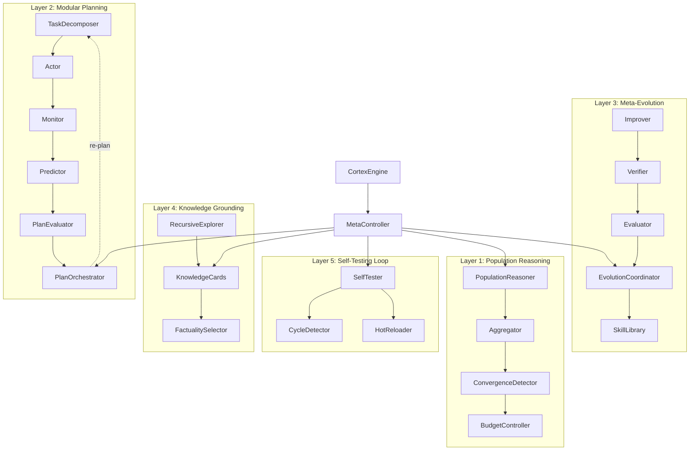

# CRSAE Architecture — Convergent Recursive Self-Aggregating Evolution

> The novel methodology that makes CortexOS the most powerful AI-native OS in existence.

## Architecture Overview

## Component Specifications

### 1. PopulationReasoner
Maintains a population of N candidate solutions. Each iteration, K candidates are sampled and aggregated into improved solutions. Continues for T iterations or until convergence.

### 2. ConvergenceDetector
Uses cosine similarity on embeddings to detect when solutions have stabilized semantically. Threshold: 0.98 for text, 0.95 for code.

### 3. BudgetController
Enforces hard resource limits at every layer. Tracks API calls, tokens, compute time. Raises BudgetExceededError when limits hit.

### 4. AdaptivePlanner
Implements the MAP (Modular Agentic Planner) architecture with dynamic re-planning. Supports plan-execute-replan cycles.

### 5. StrategyEvolver
Meta-RL system that evolves which reasoning strategies work best for which task types. Strategy weights update via EMA with learning rate 0.1.

### 6. SkillLibrary
Persistent store of reusable capabilities (code snippets, prompt templates, tool configurations) that grows with each execution. Voyager-inspired.

### 7. MetaController
The "kernel" — decides which orchestration mode, reasoning depth, and compute budget to use for each task. Evolves its own decision function over time.

### 8. SelfTester
Implements the self-dogfooding pattern where agents test their own outputs immediately after generation.

### 9. CycleDetector
Graph-based cycle detection (DFS with visited-set) for all entity resolution and recursive pipelines. Prevents infinite loops.
